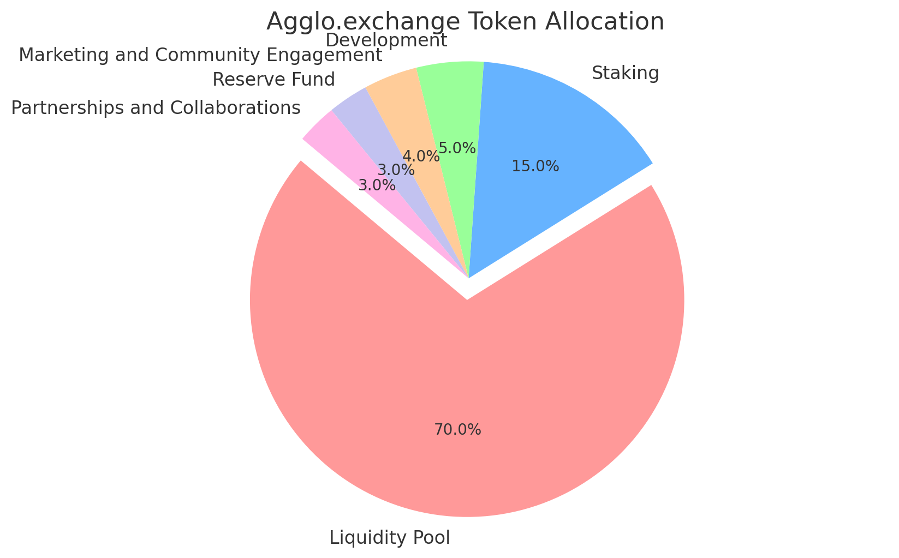

# 🪙 Tokenomics

<figure><figcaption></figcaption></figure>

Here is a detailed table summarizing the tokenomics of Agglo.exchange:

| Category                           | Percentage             | Token Amount          |
| ---------------------------------- | ---------------------- | --------------------- |
| Total Supply                       | 100%                   | 10,322,000,000 Tokens |
| Transactional Tax                  | 5% of each transaction |                       |
| Liquidity Pool                     | 70%                    | 7,225,400,000 Tokens  |
| Staking                            | 15%                    | 1,548,300,000 Tokens  |
| Development                        | 5%                     | 516,100,000 Tokens    |
| Marketing and Community Engagement | 4%                     | 412,880,000 Tokens    |
| Reserve Fund                       | 3%                     | 309,660,000 Tokens    |
| Partnerships and Collaborations    | 3%                     | 309,660,000 Tokens    |
